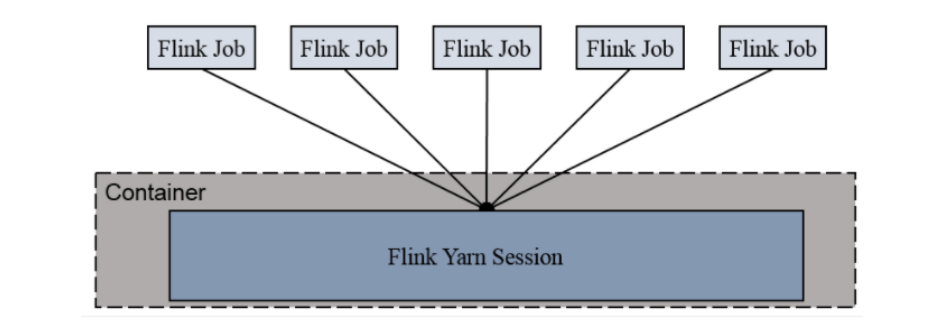
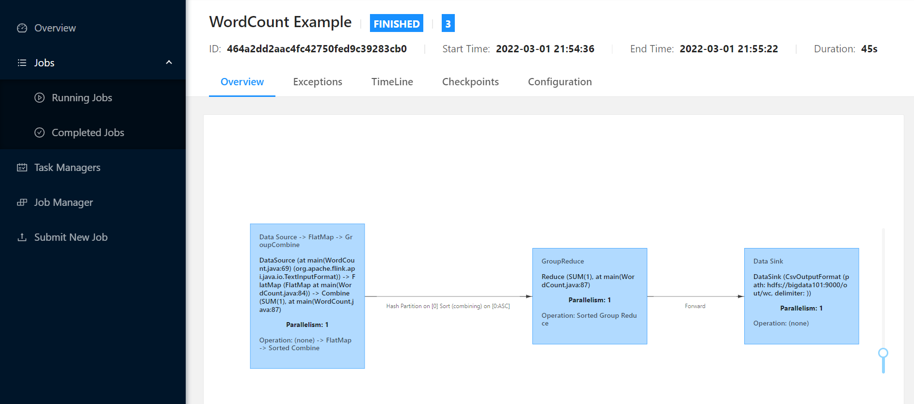
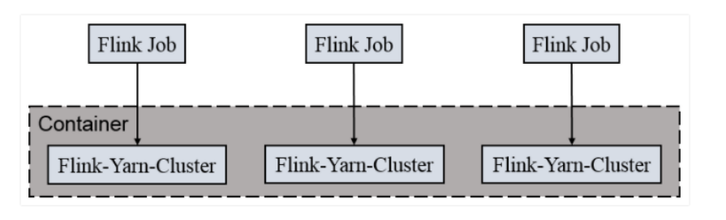

# flink on yarn 模式

**版本：flink-1.10.1**

命名行描述：[https://nightlies.apache.org/flink/flink-docs-release-1.10/ops/cli.html](https://nightlies.apache.org/flink/flink-docs-release-1.10/ops/cli.html)

--------------------------------------------------------------

[TOC]

以 yarn 模式部署 flink 任务时，要求 flink 是有 hadoop
环境需要保证版本在 2.2 以上，并且集群中安装有 HDFS 服务。

flink 提供了两种在 yarn 上运行的模式，分别为 Session-Cluster 和 Per-Job-Cluster
模式。

### 1 Session-Cluster 模式

#### 1.1 原理



Session-Cluster 模式需要先启动集群，然后再提交作业，接着会向 yarn 申请一
块空间后，资源永远保持不变。如果资源满了，下一个作业就无法提交，只能等到
yarn 中的其中一个作业执行完成后，释放了资源，下个作业才会正常提交。

所有作业共享 Dispatcher 和 ResourceManager；共享资源；适合规模小执行时间短的作业。

在 yarn 中初始化一个 flink 集群，开辟指定的资源，以后提交任务都向这里提交。这个 flink 集群会常驻在 yarn 集群中，除非手工停止。

#### 1.2 使用

（1）启动 hadoop 集群

（2）启动 yarn-session

```sh
[root@bigdata101 flink-1.10.1]# ./bin/yarn-session.sh -n 2 -s 2 -jm 1024 -tm 1024 -nm test -d
2022-03-01 21:32:26,806 INFO  org.apache.flink.configuration.GlobalConfiguration            - Loading configuration property: jobmanager.rpc.address, bigdata101
2022-03-01 21:32:26,807 INFO  org.apache.flink.configuration.GlobalConfiguration            - Loading configuration property: jobmanager.rpc.port, 6123
2022-03-01 21:32:26,807 INFO  org.apache.flink.configuration.GlobalConfiguration            - Loading configuration property: jobmanager.heap.size, 1024m
.....
JobManager Web Interface: http://bigdata102:44539
```

其中：

- -n(--container): TaskManager 的数量。

- -s(--slots): 每个 TaskManager 的 slot 数量，默认一个 slot 一个 core，默认每个
taskmanager 的 slot 的个数为 1，有时可以多一些 taskmanager，做冗余。

- -jm: JobManager 的内存（单位 MB)。 

- -tm: 每个 taskmanager 的内存（单位 MB)。 

- -nm: yarn 的 appName(现在 yarn 的 ui 上的名字)。 

- -d: 后台执行。

（3）执行任务

```sh
[root@bigdata101 flink-1.10.1]# ./bin/flink run ./examples/batch/WordCount.jar -input hdfs://bigdata101:9000/in/README.txt -output hdfs://bigdata101:9000/out/wc.txt

# [root@bigdata101 flink-1.10.1]# ./bin/flink run -c com.atguigu.wc.StreamWordCount /root/FlinkTutorial-1.0-SNAPSHOT.jar -host bigdata101 -port 7777
```

进入 `http://bigdata102:44539` 查看



（4）取消 yarn-session

```sh
[root@bigdata101 flink-1.10.1]# yarn application --kill  application_1646141521025_0003
```

### 2 Per-Job-Cluster 模式

#### 2.1 原理



一个 Job 会对应一个集群，每提交一个作业会根据自身的情况，都会单独向 yarn
申请资源，直到作业执行完成，一个作业的失败与否并不会影响下一个作业的正常
提交和运行。

独享 Dispatcher 和 ResourceManager，按需接受资源申请；适合规模大
长时间运行的作业。

每次提交都会创建一个新的 flink 集群，任务之间互相独立，互不影响，方便管
理。任务执行完成之后创建的集群也会消失。

#### 2.2 使用

（1）启动 hadoop 集群

（2）不启动 yarn-session，直接执行 job

```sh
[root@bigdata101 flink-1.10.1]# ./bin/flink run -m yarn-cluster ./examples/batch/WordCount.jar -input hdfs://bigdata101:9000/in/README.txt -output hdfs://bigdata101:9000/out/wc.txt

# [root@bigdata101 flink-1.10.1]# ./bin/flink run -m yarn-cluster -c wordcount.WordCountStreamSocket /root/FlinkTutorial-1.0-SNAPSHOT.jar -host bigdata101 -port 7777
```

----------------------------------------

来自：[尚硅谷flink教程](https://www.bilibili.com/video/BV1qy4y1q728)