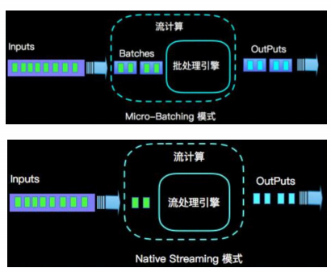

# flink 和 spark Streaming 的区别

（1）延迟性



spark streaming 是微批处理，当数据积累到一定数量，才开始处理数据，秒级延迟。

flink 是流处理，来一个数据就处理一个数据，毫秒级延迟。

flink 也可以使用有界流做批处理。

（2）数据模型

spark 采用 RDD 模型，spark streaming 的 DStream 实际上也就是一组 `组小批`
数据 RDD 的集合。

flink 基本数据模型是数据流 DataStream, 传入的就是一条条数据，也就是一个个事件(Event)序列。

（3）运行时架构

spark 是批计算，将 DAG 划分为不同的 stage, 前一个 stage 完成后才可以计算下一个。

flink 是标准的流执行模式，一个事件在一个节点处理完后可以直接发往下一个节
点进行处理。

```
             stage1 |   stage2

AAA... ----> {计算} -|----> {计算} 

BBB... ----> {计算} -|----> {计算}

对于 spark, 只有 A\B 都经历完 stage1 后，才进入到stage2,

而 flink 没有 stage 的概念，A 处理完后，直接进而下一个计算
，不用等 B 计算完。

```

----------------------------------------

来自：[尚硅谷flink教程](https://www.bilibili.com/video/BV1qy4y1q728)