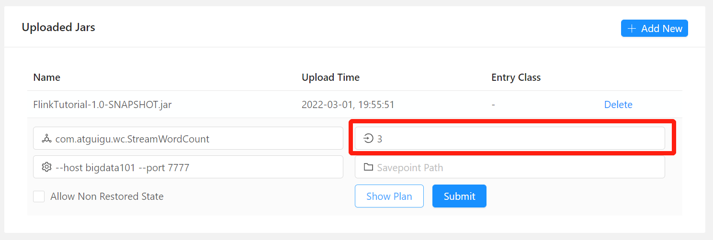
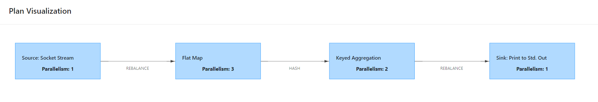

# flink 并行度设置及优先级

**版本：flink-1.10.1**

[TOC]

### 1 优先级

**`算子级别 > 全局级别 > job提交时 > 配置文件`**

### 2 设置

(1) 算子级别

```java
DataStream<Tuple2<String, Integer>> resultStream = inputDataStream.flatMap(new WordCount.MyFlatMapper())
    .keyBy(0)
    .sum(1).setParallelism(2);
```

(2) 全局级别

```java
StreamExecutionEnvironment env = StreamExecutionEnvironment.getExecutionEnvironment();
env.setParallelism(4);
```

(3) job提交时 

命令行

```sh
./bin/flink run -p 16 ./examples/batch/WordCount.jar \
                     --input file:///home/user/hamlet.txt --output file:///home/user/wordcount_out
```

web



(4) 配置文件

```sh
[root@bigdata101 flink-1.10.1]# vi conf/flink-conf.yaml 
parallelism.default: 1
```

### 3 说明

- socketTextStream 读取数据流并行度为 1

- Flat Map 采用 job 提交时设置的并行度 3

- Keyed Aggregation 采用在算子设置的并行度 2

- Sink: Print to Std.Out 采用在配置文件中设置的并行度 1

