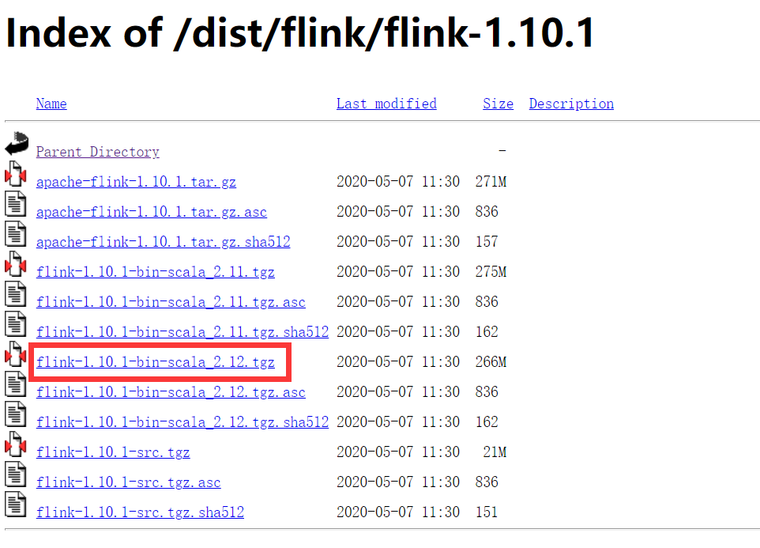
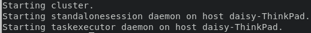
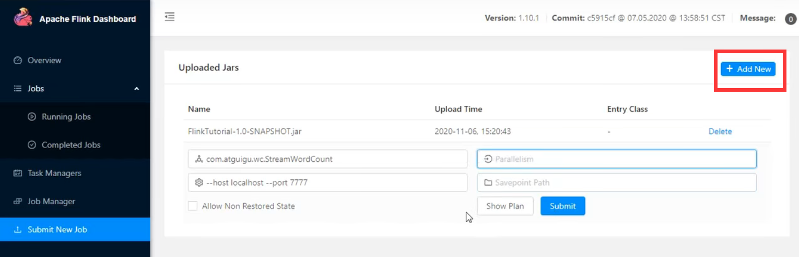
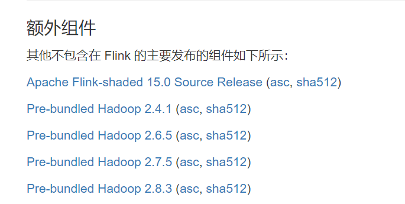
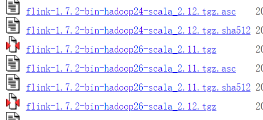

# 环境搭建及 job 提交

[TOC]

java 版本要求1.8及以上

## 本地模式

（1）下载解压 flink:

[https://archive.apache.org/dist/flink/](https://archive.apache.org/dist/flink/)



这里选择 1.10.1 版本。

（2）此时，可以执行 `bin/start-cluster.sh` 运行在本地模式下，可以看到：



执行 `ps aux | grep flink` 查看状态。

在浏览器打开 ` localhost:8081` 查看 flink dashboard.

执行 `bin/stop-cluster.sh` 停止 flink.

## standalone模式

修改 conf 目录中的 `flink-conf.yaml` 文件：

```
# 冒号+空格
jobmanager.rpc.address: bigdata101
```

修改 `slaves` 文件：

```
bigdata102
bigdata103
```

最后分发 flink 文件夹给其他节点。

## wordcount测试

### 命令行

可以在命令行下提交：

```sh
./bin/flink run -p 16 ./examples/batch/WordCount.jar \
                --input file:///home/user/hamlet.txt \
                --output file:///home/user/wordcount_out
```

注意：

（1）如果运行在 standalone 模式下，且从本地磁盘读取数据文件，那么需要将数据文件分发给各个 taskmanager 节点，此时实际任务会被分发到 taskmanager 的节点中。 

（2）如果将计算结果输出到控制台，应该在 taskmanager 下查看；如果计算结果输出到文
件，同样会保存到 taskmanager 的机器下，不会在 jobmanage 下。

取消这个 job，可以执行 `bin/flink list` 获取到 jobid,再执行 `bin/flink cancal jobid`.

查看所有的任务，包含取消的 job，可以执行 `bin/flink list -a`.

### web ui

可以在 web ui 上提交 job.

通过点击如下按钮提交 jar 包：



## on yarn 模式

部署 on yarn 模式，首先要部署好 hadoop 集群，并且下载对应的 hadoop 版本的组件，放到 flink `lib` 目录下。

在 [https://flink.apache.org/downloads.html](https://flink.apache.org/downloads.html) 中下载：



注意：需不要 hadoop 组件要视 flink 版本而定。



上面这种就表示不需要，自身已集成。

如何使用见：[https://www.bilibili.com/video/BV1qy4y1q728?p=14&spm_id_from=pageDriver](https://www.bilibili.com/video/BV1qy4y1q728?p=14&spm_id_from=pageDriver)

